# 📘 Guía de Instalación — Sage Connect for 300

Documentación paso a paso del proceso de instalación y configuración inicial de **Sage Connect for 300**, el conector de sincronización entre **Sage 300 ERP** y la base de datos local desarrollado por **ACI**.

> **Versión del producto:** 1.0.0
> **Sistema operativo:** Windows
> **Espacio requerido:** ~390.8 MB

---

## 🌐 Sitio web (GitHub Pages)

Esta documentación también está publicada como sitio web navegable. Si activaste **GitHub Pages** en la rama `main`/`docs/`, puedes acceder directamente:

- 🏠 **Inicio:** [`index.html`](index.html) — Página principal con tarjetas de cada sección.
- 🚀 **Instalación:** [`docs/instalacion.html`](docs/instalacion.html)
- 🔍 **Acceso:** [`docs/acceso.html`](docs/acceso.html)
- ⚙️ **Configuración inicial:** [`docs/configuracion.html`](docs/configuracion.html)
- 📂 **Carga de catálogos:** [`docs/catalogos.html`](docs/catalogos.html)
- 🛠️ **Configuración avanzada:** [`docs/avanzada.html`](docs/avanzada.html)

> El sitio web completo con estilo, navegación y capturas está en este repositorio. Las imágenes se sirven desde [`assets/images/`](assets/images/) y los estilos desde [`assets/css/style.css`](assets/css/style.css).

---

## 📑 Tabla de contenidos

1. [Proceso de instalación](#-proceso-de-instalación)
2. [Acceso a la aplicación](#-acceso-a-la-aplicación)
3. [Configuración inicial](#-configuración-inicial)
   - [Escritorio](#escritorio)
   - [Proceso](#proceso)
4. [Carga de catálogos](#-carga-de-catálogos)
   - [Cuentas GL](#cuentas-gl)
   - [Conjuntos de Cuentas AP / AR](#conjuntos-de-cuentas-ap--ar)
5. [Configuración avanzada](#-configuración-avanzada)
   - [Sage 300](#configuración--sage-300)
   - [Base de datos](#configuración--base-de-datos)
   - [Sincronización](#configuración--sincronización)
   - [Importación S50](#configuración--importación-s50)

---

## 🚀 Proceso de instalación

El instalador guía al usuario a través de seis pantallas para completar la instalación.

### 1. Selección de la carpeta de destino

El primer paso consiste en elegir la carpeta donde se instalará Sage Connect for 300. Por defecto el instalador propone:

```
C:\Program Files (x86)\SageConnectFor300
```

Puede modificarse usando el botón **Examinar…**. El asistente también informa que se requieren al menos **390.8 MB** de espacio libre en disco.

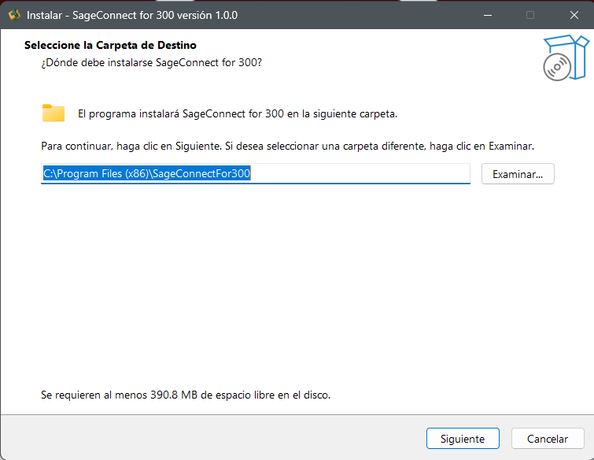

---

### 2. Activación de licencia

En esta pantalla se solicita el **número de serie** provisto con la licencia de Sage Connect for 300 (formato `SN-XXXXXXXXXXXXX-XXXXX`).

> ⚠️ **Importante:** El número de serie se valida en línea, por lo que es indispensable contar con conexión a Internet antes de continuar.

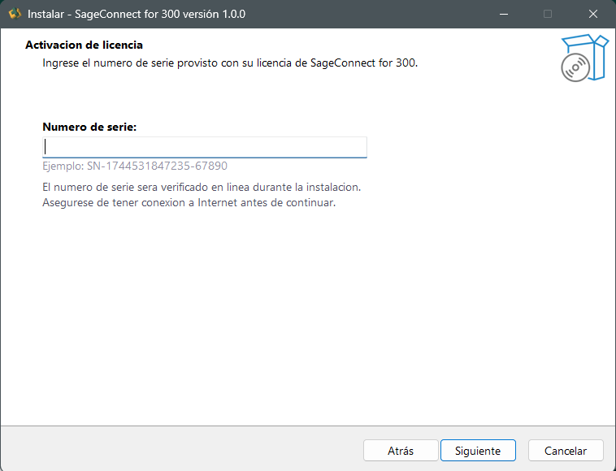

---

### 3. Carpeta del menú Inicio

Permite definir la carpeta del **Menú Inicio** donde se crearán los accesos directos del programa. Por defecto se propone:

```
SageConnect for 300
```

Puede personalizarse mediante el botón **Examinar…**.

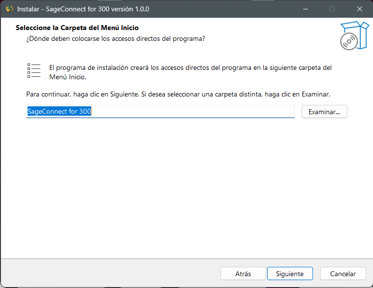

---

### 4. Tareas adicionales

Permite configurar dos acciones complementarias durante la instalación:

- ✅ **Crear acceso directo al Manager en el escritorio** (activado por defecto)
- ⬜ **Iniciar Manager automáticamente al iniciar Windows** (opcional)

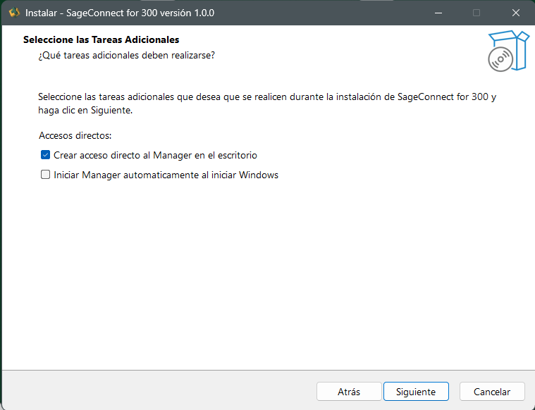

---

### 5. Listo para instalar

Pantalla de resumen con toda la configuración previa:

| Sección | Valor |
|---|---|
| **Carpeta de destino** | `C:\Program Files (x86)\SageConnectFor300` |
| **Carpeta del menú Inicio** | `SageConnect for 300` |
| **Tareas adicionales** | Crear acceso directo al Manager en el escritorio |

Al hacer clic en **Instalar** comienza la copia de archivos al equipo.

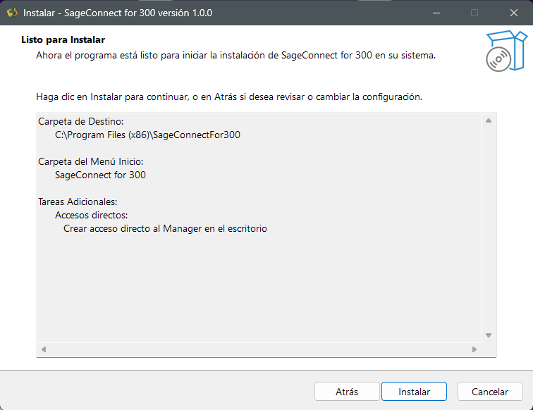

---

### 6. Instalación completada

Pantalla final que confirma que **SageConnect for 300** se instaló correctamente. Puede ejecutarse la aplicación mediante los accesos directos creados. El botón **Finalizar** cierra el asistente.

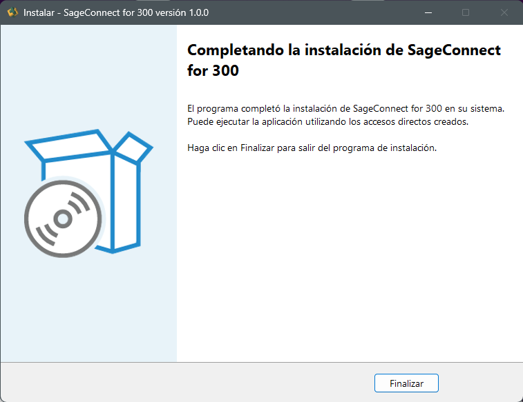

---

## 🔍 Acceso a la aplicación

Una vez finalizada la instalación, **SageConnect for 300 Manager** puede localizarse rápidamente desde el buscador de Windows.

Escribe `SageConnect for 300 Manager` en el menú Inicio y selecciónalo de la lista de **Mejor coincidencia**.

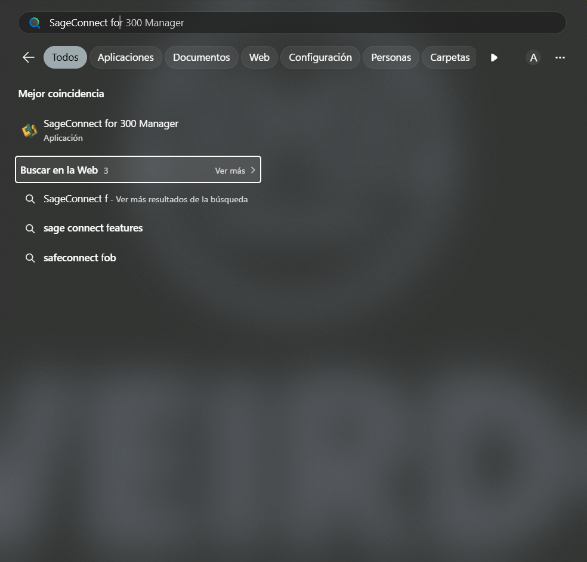

---

## 🔐 Pantalla de inicio de sesión

Al abrir el Manager aparece la pantalla de bienvenida donde se deben ingresar las **credenciales de acceso**:

- **USUARIO**
- **CONTRASEÑA**

Una vez completados ambos campos, se hace clic en **Iniciar sesión →** para acceder al escritorio principal.

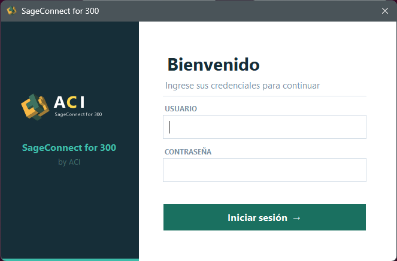

---

## ⚙️ Configuración inicial

### Escritorio

El **Escritorio** muestra el estado general del conector y permite la ejecución manual de procesos. Contiene tres secciones principales:

- **SageConnect for 300** — Cabecera con el nombre del conector y la descripción *"Conector de sincronización para Sage 300 ERP · ACI"*.
- **Estado del servicio** — Servicio Windows en ejecución, fecha de la última sincronización S300 y de la última importación S50.
- **Ejecución manual** — Botones para ejecutar manualmente la **Sincronización S300** (exporta módulos de Sage 300 hacia la BD local) y la **Importación S50 → S300** (importa datos de Sage 50 hacia Sage 300).
- **Actividad reciente** — Panel que muestra los logs recientes del sistema.

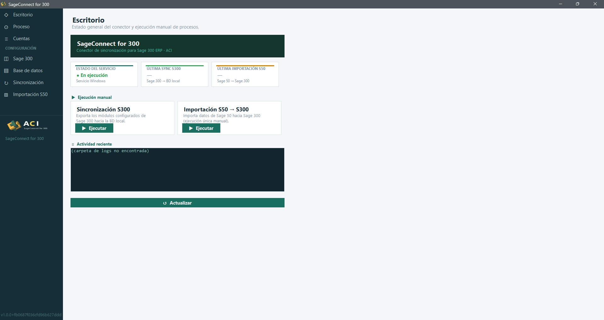

---

### Proceso

La sección **Proceso** permite configurar los intervalos y controlar manualmente los procesos de sincronización:

- **Sincronización automática — Sage 300**
  - *Intervalo de sincronización (segundos):* valor por defecto **60**.
  - *Reintentos máximos por error:* valor por defecto **1**.
- **Importación Sage 50 → Sage 300** — Operación de una sola ejecución (no se repite automáticamente), con botón **Ejecutar importación S50 ahora**.

Los cambios se guardan con el botón **Guardar configuración**.

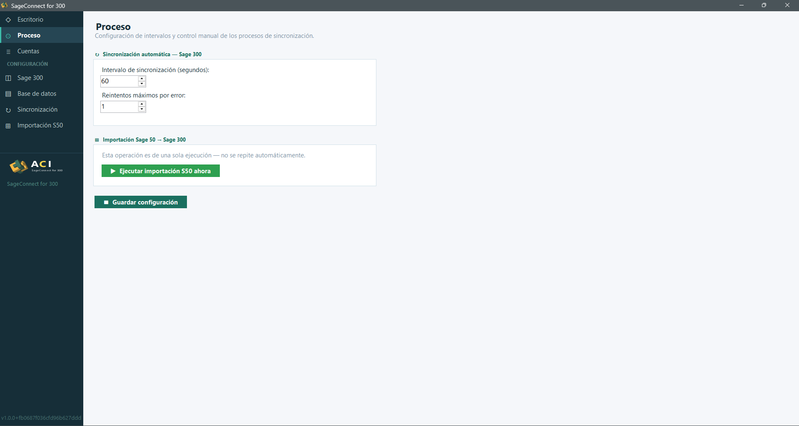

---

## 📂 Carga de catálogos

La sección **Cuentas** permite cargar manualmente los catálogos desde Sage 300 hacia la base de datos local. Se divide en dos tareas independientes.

### Cuentas GL

Permite importar el **plan de cuentas GL** desde Sage 300 mediante el botón **Importar**.

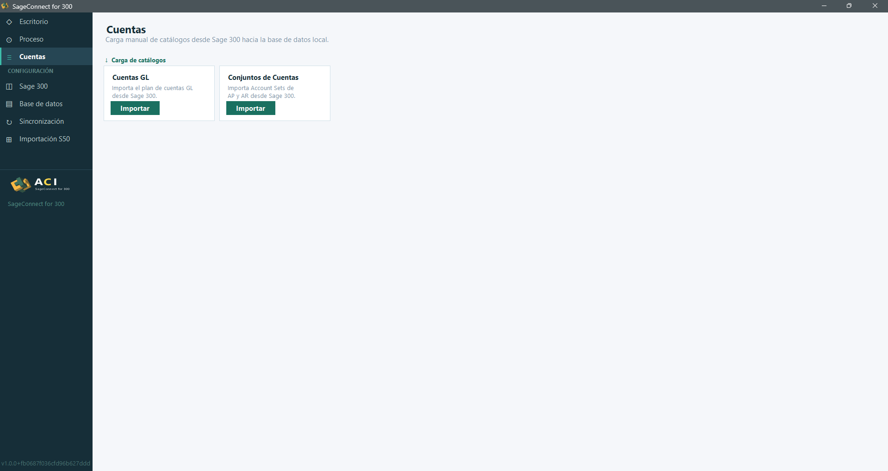

Al ejecutar la importación se abre el asistente **Importar Plan de Cuentas GL** (Paso 1 de 2), donde se selecciona el archivo Excel exportado desde Sage 50 con las cuentas contables. Opciones disponibles:

- ☑️ **Solo activas** (activado por defecto)
- ☑️ **Crear nuevas** (activado por defecto)
- ⬜ **Actualizar existentes**
- ⬜ **Log detallado**
- **Paralelas:** cantidad configurable (por defecto **8**)

Tras seleccionar el archivo, se pulsa **Importar** para iniciar el proceso. La barra de progreso y el log muestran el avance en tiempo real.

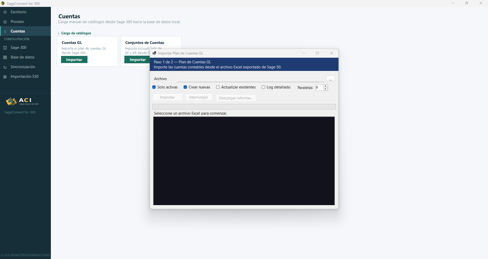

---

### Conjuntos de Cuentas AP / AR

Permite importar los **Account Sets de AP y AR** desde Sage 300 con el botón **Importar**. Esto asigna las cuentas GL de control para clientes (AR) y proveedores (AP).

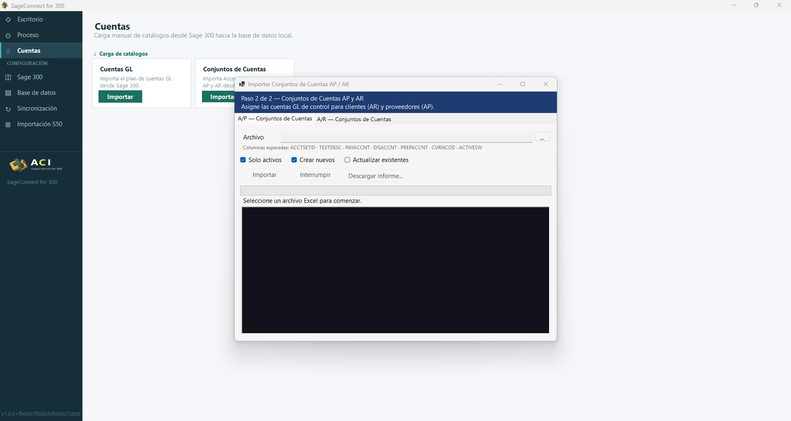

El asistente muestra dos pestañas:

- **A/P — Conjuntos de Cuentas** (`ACCTSETID · TEXTDESC · PAYACCNT · DISACCNT · PREPACCNT · CURNCOD · ACTIVESW`)
- **A/R — Conjuntos de Cuentas** (`ACCTSETID · TEXTDESC · RECACCNT · DISACCNT · PREPACCNT · WRTOFFACC · CURNCOD · ACTIVESW`)

Cada pestaña permite seleccionar el archivo Excel correspondiente, elegir entre *Solo activos*, *Crear nuevos* o *Actualizar existentes*, y ejecutar la importación.


---

## 🛠️ Configuración avanzada

El bloque **CONFIGURACIÓN** del menú lateral agrupa cuatro pantallas que deben completarse para poner en marcha el conector.

### Configuración — Sage 300

Permite definir las credenciales y el endpoint de la API de **Sage 300 ERP**:

- **API**
  - *URL base de la API* → `http://localhost/Sage300WebApi/v1.0`
  - *Empresa (Company)* → `BGSDAT`
  - *Código de estructura GL (StructureCode)* → `IDACC`
- **Credenciales**
  - *Usuario Sage 300* → `ADMIN`
  - *Contraseña Sage 300* → campo oculto (use *Mostrar contraseña* para revelar)
- **Defaults para importación S50 → S300**
  - *Grupo de cliente AR (CustomerGroup)* → `SLSUSD`
  - *Grupo de proveedor AP (VendorGroup)* → `RPRUSD`

Dispone además del botón **Cambiar contraseña de acceso** para modificar la contraseña del Manager. Use **Guardar** para conservar los cambios.

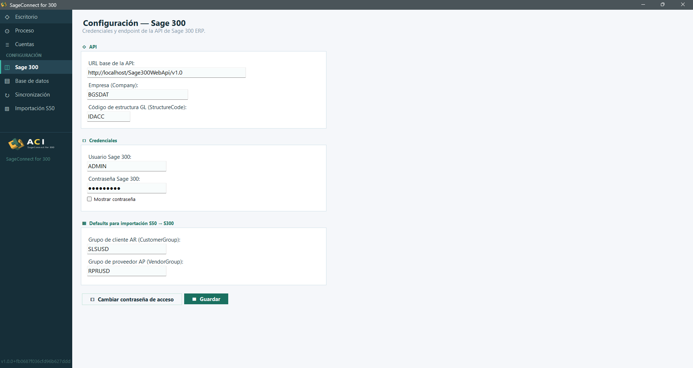

---

### Configuración — Base de datos

Define la conexión al motor de base de datos donde se almacenan las tablas sincronizadas.

- **Proveedor de base de datos**
  - � **SQL Server** (por defecto)
  - ○ **MySQL / MariaDB**
- **SQL Server — cadena de conexión**

  Ejemplo mostrado:

  ```
  Server=localhost;Database=SageConnect;Trusted_Connection=True;TrustServerCertificate=True;
  ```

  > 💡 **Sugerencia:** Para autenticación Windows usar `Trusted_Connection=True`. Para SQL usar `User Id=sa;Password=xxxxx;`.

Acciones disponibles:

- **Probar conexión** — Verifica que la cadena de conexión sea válida.
- **Inicializar esquema completo (76 tablas)** — Crea todas las tablas necesarias en la base de datos.
- **Guardar** — Persiste los cambios.

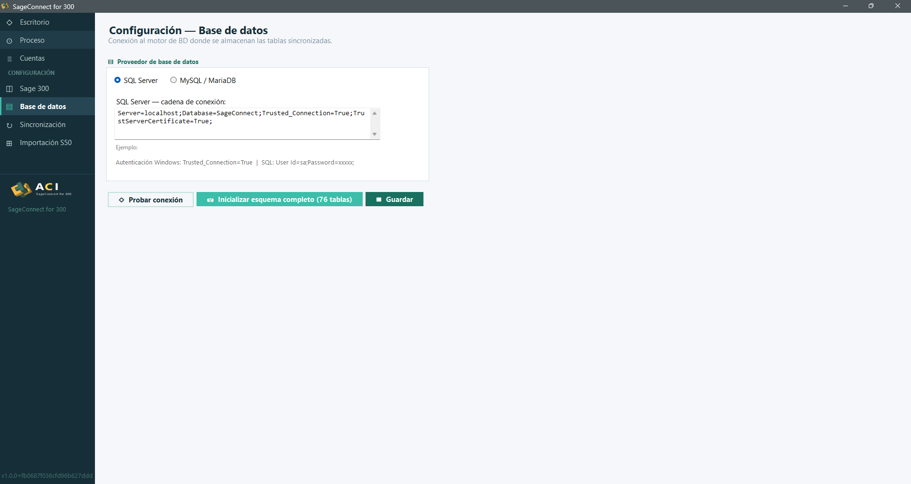

---

### Configuración — Sincronización

Permite seleccionar los **módulos de Sage 300** que se exportarán a las tablas de la BD local:

- **Módulos básicos**
  - ⬜ Clientes (AR Customers)
  - ⬜ Proveedores (AP Vendors)
  - ⬜ Artículos (IC Items) — *requiere licencia*
  - ⬜ Órdenes (OE Orders) — *requiere licencia*
  - ⬜ Cuentas GL (GL Accounts)
- **AR — Documentos financieros**
  - ⬜ Documentos posteados (ARPostedDocuments)
  - ⬜ Recibos posteados (ARPostedReceipts)
  - ⬜ Pagos (ARPayments)
  - ⬜ Lotes de facturas (ARInvoiceBatches)
  - ⬜ Lotes de cobros (ARReceiptBatches)
  - ⬜ Lotes de reembolsos (ARRefundBatches)
- **AP — Documentos financieros**
  - ⬜ Documentos posteados (APPostedDocuments)
  - ⬜ Lotes de facturas (APInvoiceBatches)
  - ⬜ Lotes de pagos (APPaymentBatches)

Tras seleccionar los módulos deseados se pulsa **Guardar**.

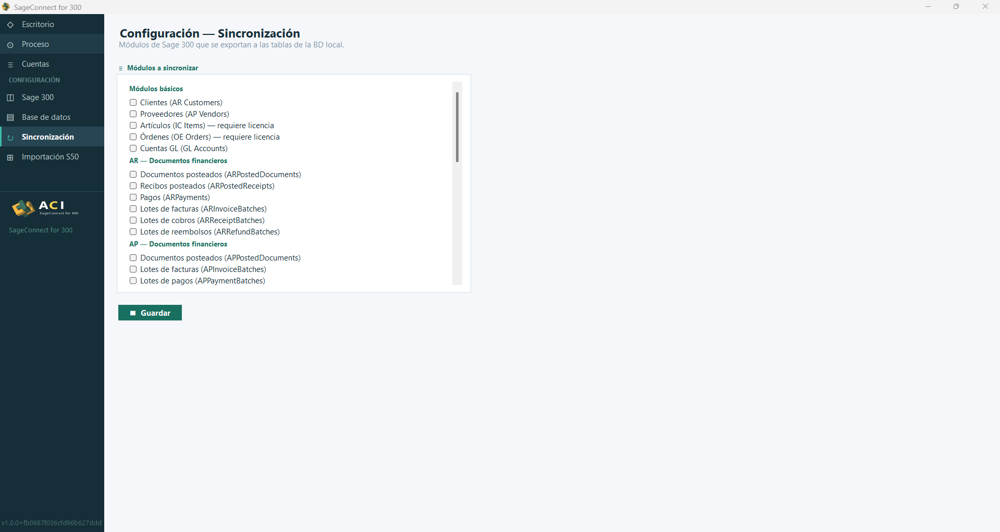

---

### Configuración — Importación S50

Permite configurar los módulos y la fuente de datos para la importación **Sage 50 → Sage 300**.

- **Habilitación**
  - ☑️ **Habilitar importación Sage 50 → Sage 300**
- **Fuente de datos**
  - ○ **Imp — Staging Sage 50** (`_Imp`)
  - ⦿ **Exp — Exportación Sage 50** (`_Exp_S50`) (seleccionado por defecto)
  - *ID Compañía S50:* `1`
  - *Separador GL:* `-`
- **Módulos a importar**
  - **Maestros**
    - ☑️ Clientes (Customers_Exp)
    - ☑️ Proveedores (Vendors_Exp)
    - ☑️ Productos (Products_Exp)
    - ☑️ Contactos (Contacts_Exp)
    - ☑️ Trabajos (Jobs_Exp)
    - ⬜ Fases (no disponible en Exp)
    - ⬜ Códigos de costo (no disponible en Exp)
    - ⬜ Ajuste de inventario (no disponible en Exp)
  - **Ventas**
    - ☑️ Facturas de venta (SalesInvoice_Header_Exp)
    - ☑️ Órdenes de venta (SalesOrder_Header_Exp)
  - **Compras**
    - ☑️ Facturas de compra (Purchase_Header_Exp)
  - **Financiero** *(sección visible al hacer scroll)*

Pulse **Guardar** para aplicar los cambios.

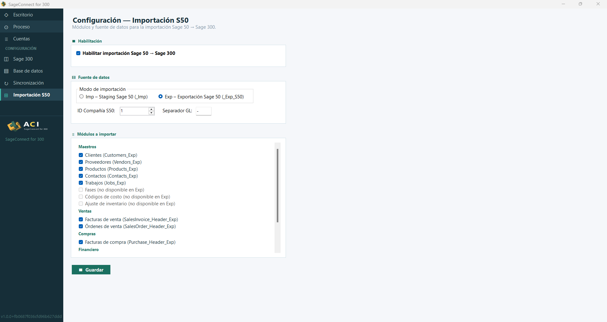

---

## ✅ Lista de verificación post-instalación

| # | Paso | Verificado |
|---|---|---|
| 1 | Instalación completada sin errores | ☐ |
| 2 | Acceso directo al Manager disponible | ☐ |
| 3 | Inicio de sesión exitoso | ☐ |
| 4 | Configuración de proceso (intervalos y reintentos) | ☐ |
| 5 | Importación del Plan de Cuentas GL | ☐ |
| 6 | Importación de Conjuntos de Cuentas AP/AR | ☐ |
| 7 | Configuración de Sage 300 (URL, credenciales, defaults) | ☐ |
| 8 | Configuración de Base de datos (cadena y esquema inicializado) | ☐ |
| 9 | Selección de módulos de sincronización | ☐ |
| 10 | Configuración de Importación S50 | ☐ |

---

## 📞 Soporte

Para más información o soporte técnico sobre **Sage Connect for 300**, contacta al equipo de **ACI**.

---

> Documentación generada a partir de las capturas del proceso de instalación. Imágenes referenciadas en la carpeta [`assets/images/`](assets/images/).
